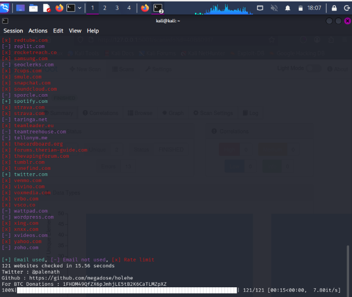
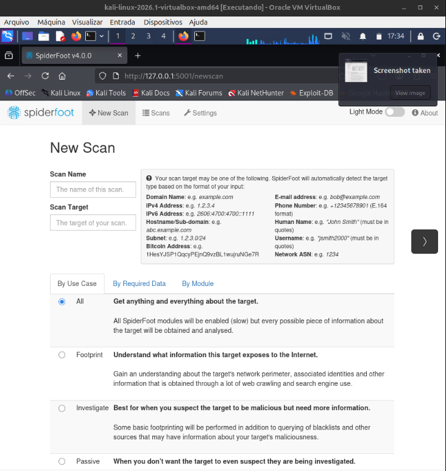
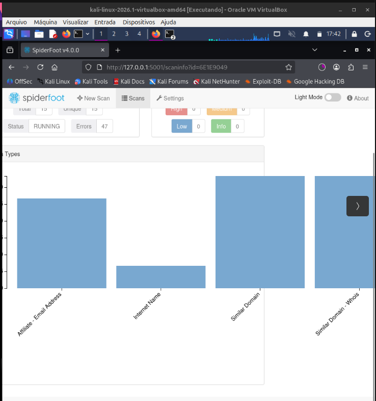
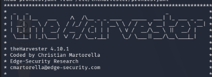

# 🐉 Laboratório Prático — Kali Linux

**Ambiente:** Kali Linux 2026.1 (VirtualBox)  
**Categoria:** OSINT / Redes / Criptografia / Anonimato  
**Data:** julho/2026  
**Contexto:** Laboratório pessoal por curiosidade, fora do TryHackMe

> Sessão de estudos práticos explorando ferramentas reais do Kali Linux,
> configuração de VPN, OSINT e análise de hashes.

---

## 🛡️ 1. VPN e Infraestrutura de Anonimato

### OpenVPN — ProtonVPN via terminal

Configurei e executei uma VPN pelo terminal usando um arquivo `.ovpn` do ProtonVPN.

```bash
sudo openvpn mx-free-9.protonvpn.udp.ovpn
```

**Problema encontrado — TLS Error com UDP:**
```
TLS key negotiation failed to occur within 60 seconds
TLS Error: TLS handshake failed
```

**Solução — Mudar para TCP:**
O protocolo UDP é mais rápido mas não verifica se os pacotes chegaram.
Na minha rede local, o UDP estava sendo bloqueado. A solução foi usar o arquivo `.ovpn` com TCP,
que faz um handshake rigoroso e conseguiu contornar o bloqueio.

| Protocolo | Característica | Resultado |
|-----------|---------------|-----------|
| UDP | Rápido, sem confirmação | ❌ Bloqueado pela rede local |
| TCP | Mais lento, com handshake | ✅ Conexão estabilizada |

**Resultado:** Tráfego redirecionado criptografado para **Cingapura** (IP `149.50.211.148`).

### 🖼️ Print


---

### DNS Leak — Diagnóstico e Correção

Mesmo com a VPN ativa, o sistema ainda consultava os servidores DNS da operadora (Claro NXT),
revelando a localização real. Isso é chamado de **DNS Leak**.

**Correção aplicada:**
```bash
echo -e "nameserver 1.1.1.1\nnameserver 8.8.8.8" | sudo tee /etc/resolv.conf
```

Isso substituiu os servidores da operadora por:
- `1.1.1.1` → Cloudflare (privado e rápido)
- `8.8.8.8` → Google DNS

**Verificação:** Site BrowserLeaks confirmou que o vazamento foi corrigido.

### Limitações do anonimato com VPN
A VPN protege a camada de rede, mas não protege o comportamento:
- Login em contas pessoais (Google, Discord) ainda identifica o usuário
- **Browser Fingerprint**: resolução de tela, fuso horário e configurações do navegador
  podem identificar o perfil mesmo sem o IP real

---

## 🔎 2. OSINT — Inteligência de Fontes Abertas

### holehe — Rastreamento de e-mail

Ferramenta que verifica se um e-mail está cadastrado em dezenas de sites simultaneamente.

```bash
holehe email@exemplo.com
```

**Resultado da varredura:**
- 121 sites verificados em 15.56 segundos
- `[+]` Email usado | `[-]` Email não usado | `[x]` Rate limit

**Contas encontradas no teste:**
- ✅ Twitter (X)
- ✅ Spotify

```
[+] Email used, [-] Email not used, [x] Rate Limit
121 websites checked in 15.56 seconds
```

### 🖼️ Print


---

### SpiderFoot — Mapeamento de superfície de ataque

Ferramenta OSINT com interface web que coleta automaticamente informações
sobre um alvo (domínio, IP, e-mail, etc.) usando dezenas de módulos.

```bash
spiderfoot -l 127.0.0.1:5001
# Acessa via navegador: http://127.0.0.1:5001
```

**Modos de scan disponíveis:**
| Modo | Descrição |
|------|-----------|
| **All** | Coleta tudo sobre o alvo (mais completo, mais lento) |
| **Footprint** | Mapeia o que o alvo expõe na internet |
| **Investigate** | Usado quando se suspeita que o alvo é malicioso |
| **Passive** | Não interage com o alvo diretamente |

**Tipos de dados coletados no scan:**
- Affiliate Email Address
- Internet Name
- Similar Domain
- Similar Domain - Whois

**Status do scan:** Running | 15 Total | 15 Unique | 47 Errors

### 🖼️ Prints



---

### theHarvester — Coleta de e-mails e subdomínios

Ferramenta clássica de OSINT para coletar e-mails, subdomínios, IPs e
nomes de funcionários de fontes públicas como Google, Bing, LinkedIn e Shodan.

```bash
theHarvester -d dominio.com -b google
```

**Versão utilizada:** theHarvester 4.10.1  
**Criado por:** Christian Martorella — Edge-Security Research

### 🖼️ Print


---

### PhoneInfoga — OSINT para números de telefone

Ferramenta para coletar informações públicas sobre números de telefone.
Exige o formato **E.164**: `+5511999999999`

```bash
phoneinfoga scan -n +5511999999999
```

---

## 🧠 3. Vetores de Ataque e Engenharia Social

### SIM Swapping
Ataque onde o hacker usa engenharia social com a operadora para clonar o chip da vítima,
interceptando SMS e burlando autenticação por mensagem de texto.

**Por que SMS como 2FA é fraco:**
- Vulnerável a SIM Swapping
- Malwares podem interceptar mensagens no celular

**Alternativas mais seguras:**
- Aplicativos TOTP (Google Authenticator, Aegis)
- Chaves físicas de segurança (YubiKey)

### Spear Phishing com dados vazados
Quando dados pessoais (Nome, Telefone, Data de Nascimento) são cruzados,
o atacante consegue criar ataques altamente personalizados.

### BEC (Business Email Compromise)
Golpe onde dados corporativos vazados (CNPJ, e-mails, endereço) são usados
para criar boletos falsos e enganar o setor financeiro de empresas.

---

## 🔑 4. Criptografia — Hashes e John the Ripper

### O que é um Hash?
Sistemas seguros nunca salvam senhas em texto puro.
A senha é transformada em um código matemático irreversível (hash).

```
senha123  →  MD5  →  482c811da5d5b4bc6d497ffa98491e38
```

### John the Ripper — Quebra de hashes

Ferramenta para testar a força de hashes usando dicionários de senhas.

```bash
# Gerar hash MD5 para testar
echo -n "senha123" | md5sum

# Salvar o hash em um arquivo
echo "482c811da5d5b4bc6d497ffa98491e38" > hash.txt

# Quebrar com wordlist rockyou
john --format=raw-md5 --wordlist=/usr/share/wordlists/rockyou.txt hash.txt

# Ver resultado
john --show hash.txt
```

**rockyou.txt:** Lista com milhões de senhas reais vazadas, incluída por padrão no Kali Linux.
Senhas fracas são quebradas em **milissegundos**.

---

## 💡 Conclusão do laboratório

| Área | Ferramenta | O que aprendi |
|------|-----------|--------------|
| Anonimato | OpenVPN | UDP vs TCP, DNS Leak |
| OSINT | holehe | Rastrear e-mail em 121 sites |
| OSINT | SpiderFoot | Mapear superfície de ataque |
| OSINT | theHarvester | Coletar subdomínios e e-mails |
| OSINT | PhoneInfoga | Pesquisar números de telefone |
| Criptografia | John the Ripper | Quebrar hashes MD5 com wordlist |
| Defesa | — | SIM Swap, BEC, Browser Fingerprint |

> Este laboratório foi feito por curiosidade pessoal, fora das salas do TryHackMe,
> em ambiente controlado de VM para fins educacionais.
