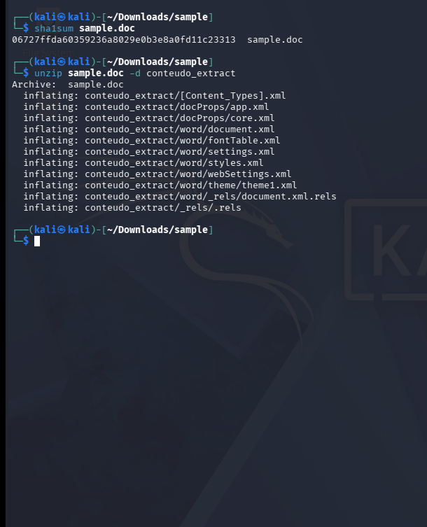
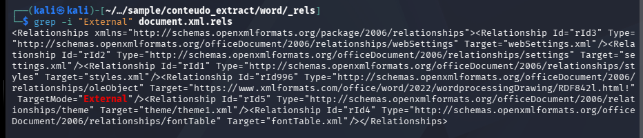
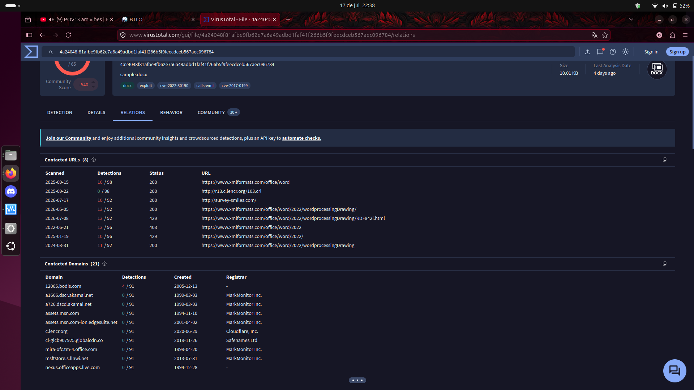
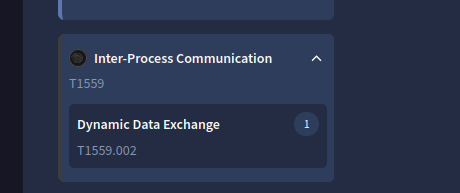

# 🦠 Follina — Análise de Malware

**Plataforma:** Blue Team Labs Online (BTLO)  
**Categoria:** Análise de Malware / OSINT / Threat Intelligence  
**Dificuldade:** Fácil (10 pontos)  
**Ferramentas:** Kali Linux, VirusTotal, unzip, sha1sum, grep  
**Data:** 17/07/2026

---

## Cenário

> "Em uma sexta-feira à noite, quando você estava animado para celebrar o fim de semana,
> sua equipe foi alertada sobre uma nova vulnerabilidade RCE sendo ativamente explorada.
> Você foi encarregado de analisar e pesquisar a amostra para coletar informações para a equipe do fim de semana."

---

## ⚙️ Configuração do Ambiente

O arquivo do desafio vem em `.zip` com senha `infected` — padrão para amostras de malware,
para evitar execução acidental e que o antivírus delete o arquivo antes da análise.

**Regras de segurança seguidas:**
- Usado Kali Linux em VM com rede em modo **Host-Only** (isolado da internet)
- Malware nunca foi executado — apenas **análise estática**
- Resultados analisados na máquina host pela tela da VM

**Transferência do arquivo para a VM:**
```bash
# Na máquina física (dentro da pasta Downloads)
python3 -m http.server 8000

# Dentro do Kali Linux (VM)
wget http://[IP_DA_MAQUINA_FISICA]:8000/Challenge.zip
unzip Challenge.zip  # senha: infected
```

---

## 🔬 Análise Estática — Passo a Passo

### Passo 1 — Identificar o arquivo
```bash
ls -la
# Saída: sample.doc (mas a estrutura revela formato OpenXML)

file sample.doc
# Saída: Microsoft Word 2007+ document
```

Apesar da extensão `.doc`, o conteúdo binário revelou estruturas XML típicas de `.docx` (OpenXML):
```
word/document.xml
[Content_Types].xml
word/_rels/document.xml.rels
word/theme/theme1.xml
```

Um arquivo `.docx` é na verdade um **arquivo ZIP** contendo arquivos XML.
Atacantes disfarçam `.docx` como `.doc` para confundir antivírus e acionar vulnerabilidades do modo de compatibilidade.

---

### Passo 2 — Gerar o hash (impressão digital do arquivo)
```bash
sha1sum sample.doc
# Saída: 06727ffda60359236a8029e0b3e8a0fd11c23313
```

O hash é a "impressão digital" única de um arquivo. Se um único byte mudar, o hash muda completamente.
Usado para identificar a amostra exata de malware em bancos de dados de inteligência de ameaças.

### 🖼️ Print — Hash SHA1 e extração do arquivo


---

### Passo 3 — Extrair e inspecionar a estrutura do documento
```bash
unzip sample.doc -d conteudo_extract
cd conteudo_extract/word/_rels/
grep -i "External" document.xml.rels
```

O arquivo `document.xml.rels` armazena todos os **relacionamentos externos** — links que o documento
tenta acessar quando aberto. É aqui que a URL maliciosa estava escondida.

### 🖼️ Print — Grep encontrando a URL maliciosa


A saída do `grep` revelou um atributo `Target` apontando para uma URL externa com `TargetMode="External"` —
o link que o documento acessa silenciosamente quando aberto no Microsoft Word.

---

## 📋 Análise no VirusTotal

Pesquisei o hash SHA1 no VirusTotal para coletar inteligência de ameaças.

**Principais descobertas:**
- **Nome do arquivo:** `sample.docx`
- **Tipo de arquivo:** Office Open XML Document
- **Pontuação da comunidade:** -540 (altamente malicioso)
- **Tags:** `docx`, `exploit`, `cve-2022-30190`, `calls-wmi`, `cve-2017-0199`
- **Detecções:** 65 motores de antivírus sinalizaram o arquivo

### 🖼️ Print — Aba Relations do VirusTotal com URLs contactadas


### 🖼️ Print — Técnica MITRE ATT&CK T1559


---

## 🔍 Perguntas e Respostas do Desafio

### Q1 — Hash SHA1 da amostra
```bash
sha1sum sample.doc
```
**Resposta:** `06727ffda60359236a8029e0b3e8a0fd11c23313`

---

### Q2 — Tipo de arquivo completo segundo o VirusTotal
Encontrado na aba **Details** do VirusTotal no campo "File type".

**Resposta:** `Office Open XML Document`

---

### Q3 — URL maliciosa embutida na amostra
```bash
unzip sample.doc -d conteudo_extract
cd conteudo_extract/word/_rels/
grep -i "External" document.xml.rels
```
Procurar o atributo `Target=` com `TargetMode="External"`.

**Resposta:** `https://www.xmlformats.com/office/word/2022/wordprocessingDrawing/RDF842l.html`

---

### Q4 — Arquivo XML que armazena a URL extraída
A URL foi encontrada dentro de:

**Resposta:** `document.xml.rels`

---

### Q5 — Tamanho mínimo do arquivo para acionar o payload
O exploit Follina abusa do componente Windows `mshtml.dll` que tem um tamanho de buffer fixo no código.
Arquivos menores que esse limite são processados de forma diferente e não acionam o exploit.
Atacantes enchem os arquivos HTML com dados inúteis (caracteres repetidos) para ultrapassar esse limite.

**Resposta:** `4096`

---

### Q6 — Processo que a amostra tenta encerrar na execução

**Como descobrir:**
O exploit Follina invoca o `msdt.exe` (Microsoft Support Diagnostic Tool) para executar comandos.
Para esconder os rastros, o malware imediatamente tenta encerrar esse processo para que nenhuma janela de diagnóstico apareça.

**Método usado:** OSINT — pesquisar `CVE-2022-30190 taskkill` revela o nome do processo.
**Também visível em:** VirusTotal aba BEHAVIOR → seção Command Executed.

**Resposta:** `msdt.exe`

---

### Q7 — ProcessName e ParentProcessName para regra de detecção com Event ID 4688

**Windows Event ID 4688** = "Um novo processo foi criado"

Toda vez que um processo cria outro, o Event 4688 registra:
- `ParentProcessName` = o programa que deu a ordem
- `ProcessName` = o programa que foi criado

**Cadeia do ataque:**
```
Usuário abre sample.doc
        ↓
winword.exe lê o documento
        ↓
Exploit Follina é acionado
        ↓
winword.exe cria o msdt.exe
        ↓
msdt.exe executa comandos maliciosos do PowerShell
```

**Método OSINT:** Pesquisar `CVE-2022-30190 sigma rule 4688` no GitHub (SigmaHQ) revela:
```yaml
ParentImage|endswith: '\winword.exe'
Image|endswith: '\msdt.exe'
```

**Resposta:** `msdt.exe, winword.exe`

---

### Q8 — ID da técnica MITRE ATT&CK de Execução

Encontrado no VirusTotal → aba **BEHAVIOR** → MITRE ATT&CK Tactics and Techniques → seção Execution.

**Técnica:** Inter-Process Communication (IPC)
**Sub-técnica:** Dynamic Data Exchange (DDE)

O DDE é um recurso legítimo da Microsoft que permite que programas do Office compartilhem dados dinamicamente.
Atacantes abusam dele para fazer o Word buscar e executar conteúdo de uma URL externa silenciosamente.

**Resposta:** `T1559`

---

### Q9 — CVE associada à vulnerabilidade

O nome popular "Follina" corresponde ao identificador CVE oficial.
**Método OSINT:** Pesquisar `Follina CVE` no Google.

**Resposta:** `CVE-2022-30190`

---

## 🧠 Conceitos aprendidos

| Conceito | Definição |
|---------|----------|
| **Análise Estática** | Examinar um arquivo sem executá-lo |
| **OpenXML / DOCX** | Arquivos `.docx` são ZIPs contendo arquivos XML |
| **Hash SHA1** | Impressão digital única do arquivo com 40 caracteres |
| **Relacionamento Externo** | Links dentro de documentos Office que buscam conteúdo remoto |
| **Follina (CVE-2022-30190)** | Vulnerabilidade que abusa do manipulador de URL ms-msdt:// para executar comandos |
| **msdt.exe** | Microsoft Support Diagnostic Tool — abusada pelo Follina |
| **winword.exe** | Processo do Microsoft Word — processo pai malicioso neste ataque |
| **Event ID 4688** | Log do Windows: "Um novo processo foi criado" |
| **MITRE T1559** | Inter-Process Communication — técnica usada para execução |
| **DDE** | Dynamic Data Exchange — recurso legítimo abusado para execução de código |
| **Regra Sigma** | Formato padrão da comunidade para escrever regras de detecção |

---

## 🔗 Fluxo do Ataque

```
[sample.doc aberto]
        ↓
winword.exe carrega o documento
        ↓
Relacionamento externo em document.xml.rels é acionado
        ↓
Word busca HTML malicioso de xmlformats.com
        ↓
HTML explora o mshtml.dll (arquivo precisa ter > 4096 bytes)
        ↓
msdt.exe é invocado via manipulador de URL ms-msdt://
        ↓
Comandos maliciosos do PowerShell são executados
        ↓
taskkill /f /im msdt.exe (esconder evidências)
        ↓
Payload entregue
```

> Esta foi minha **primeira análise de malware real** usando a plataforma BTLO,
> trabalhando com uma amostra maliciosa de verdade em um ambiente Kali Linux isolado.
