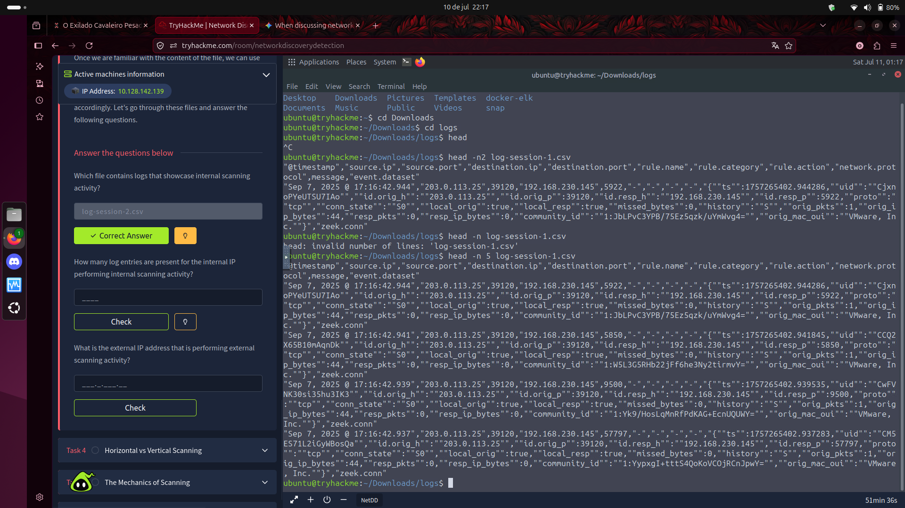
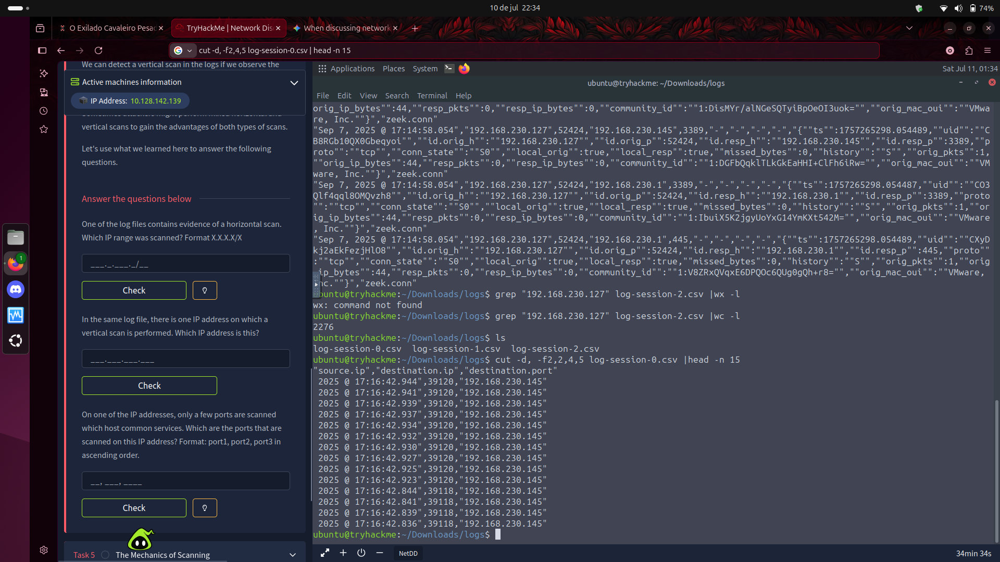
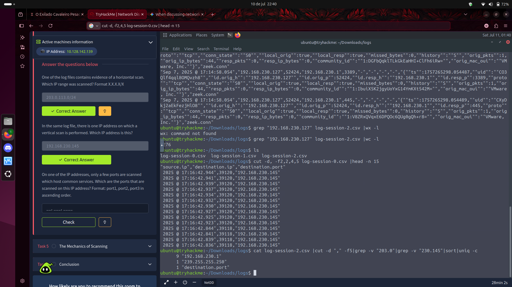
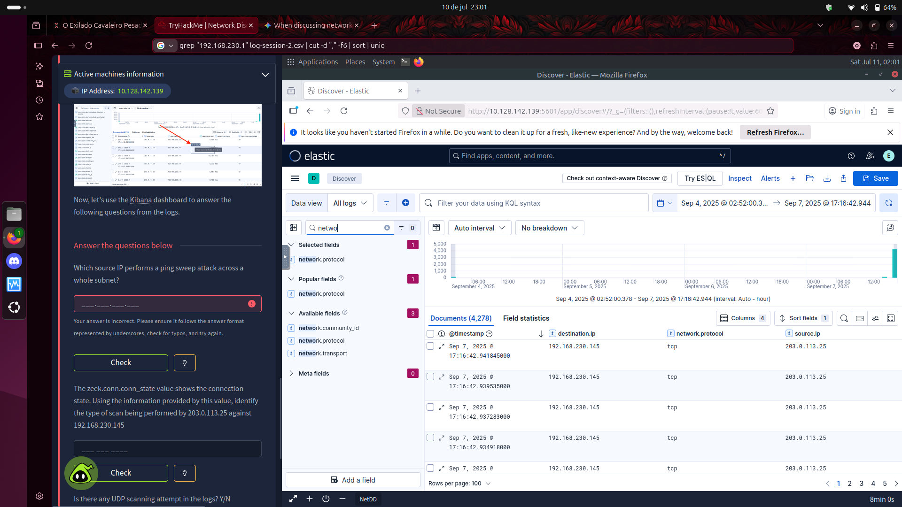

# 🔍 Network Discovery & Scanning

**Plataforma:** TryHackMe  
**Nível:** ⭐⭐ Médio  
**Categoria:** Network Security / SOC / Blue Team  
**Data:** 11/07/2026  
**Ferramentas:** Terminal Linux, Zeek logs, Kibana / Elastic Stack

---

## O que é Network Discovery?

É a fase em que um atacante (ou analista legítimo) mapeia a infraestrutura do alvo:
quais hosts estão ativos e quais portas/serviços estão disponíveis.

---

## 🌐 External vs Internal Scanning

| | External Scanning | Internal Scanning |
|---|---|---|
| **Origem** | IP público (`203.0.113.25`) | IP privado (`192.168.230.127`) |
| **Destino** | IPs públicos da organização | IPs internos da mesma rede |
| **Fase MITRE** | Reconnaissance | Discovery |
| **Significado** | Atacante ainda fora da rede | Atacante já invadiu uma máquina |
| **Severidade** | 🟡 Baixa — bots fazem isso o tempo todo | 🔴 Alta/Crítica — exige resposta a incidente |
| **Resposta** | Bloquear IP no firewall | Acionar processo de IR completo |

### Caso prático investigado
- **Scanning externo:** IP `203.0.113.25` varrendo `192.168.230.145`
- **Scanning interno:** IP `192.168.230.127` varrendo a rede interna
- **Arquivo com scanning interno:** `log-session-2.csv` ✅

---

## ↔️ Horizontal vs Vertical Scanning

### Horizontal Scanning
Uma porta fixa testada em vários IPs diferentes.

```
203.0.113.25 → 192.168.230.1   porta 445
203.0.113.25 → 192.168.230.2   porta 445
203.0.113.25 → 192.168.230.3   porta 445
...
```

**Objetivo:** Encontrar qualquer máquina vulnerável a um serviço específico.
**Exemplo real:** WannaCry varrendo a porta 445 (SMB) em busca de máquinas vulneráveis.
**IP range varrido no lab:** `203.0.113.0/24`

### Vertical Scanning
Múltiplas portas testadas em um único IP.

```
192.168.230.127 → 192.168.230.145   porta 22
192.168.230.127 → 192.168.230.145   porta 80
192.168.230.127 → 192.168.230.145   porta 443
...
```

**Objetivo:** Mapear todos os serviços de uma máquina específica (footprinting).
**IP alvo do vertical scan no lab:** `192.168.230.145`
**Total de entradas encontradas:** 2276 (via `grep "192.168.230.127" log-session-2.csv | wc -l`)

---

## ⚙️ Mecânicas técnicas de scanning

### Ping Sweep
```
Atacante → ICMP Echo Request → Vítima
Vítima   → ICMP Echo Reply  → Atacante (está online!)
```
Envia ICMP para um range inteiro de IPs. Facilmente bloqueado por firewalls modernos.

### TCP SYN Scan (mais comum e furtivo)
```
Atacante → SYN        → Vítima
Vítima   → SYN-ACK   → Atacante (porta aberta!)
Atacante → RST        → Vítima   (corta a conexão)
```
Não completa o handshake TCP, evitando criar sessão no alvo e dificultando detecção.

### UDP Scan
```
Atacante → Pacote UDP vazio → Vítima
Vítima   → ICMP "inacessível" → porta FECHADA
Vítima   → (silêncio/timeout) → porta ABERTA (assume-se)
```
Lento e instável. Sem confirmação de entrega por definição do protocolo UDP.

---

## 💻 Análise prática no terminal Linux

### Comandos utilizados nos logs CSV/Zeek

```bash
# Ver cabeçalho do arquivo para entender as colunas
head -n 5 log-session-1.csv

# Isolar colunas específicas (source.ip, destination.ip, destination.port)
cut -d "," -f2,4,5 log-session-0.csv | head -n 15

# Contar entradas de um IP específico
grep "192.168.230.127" log-session-2.csv | wc -l
# Resultado: 2276

# Listar IPs de destino únicos (excluindo IPs conhecidos)
cat log-session-2.csv | cut -d "," -f5 | grep -v "203.0" | grep -v "230.145" | sort | uniq -c
# Resultado: 9 "192.168.230.1" | 1 "239.255.255.250"
```

### Comandos essenciais aprendidos

| Comando | Função |
|---------|--------|
| `head -n X arquivo` | Espia as primeiras X linhas |
| `cut -d "," -f X` | Isola coluna X usando vírgula como separador |
| `grep "termo"` | Filtra linhas que contêm o termo |
| `grep -v "termo"` | Remove linhas que contêm o termo (inverso) |
| `sort \| uniq -c` | Ordena e conta valores repetidos |
| `wc -l` | Conta o número de linhas |

### 🖼️ Prints




---

## 📊 Investigação no Kibana / Elastic Stack

O Kibana centraliza os logs em interface visual para investigação SOC.

### Configuração da análise
- **Interface:** Elastic Discover (`http://10.128.142.139:5601`)
- **Data view:** All logs
- **Time range:** Sep 4, 2025 → Sep 7, 2025
- **Total de documentos:** 4.278

### Colunas adicionadas à tabela
- `@timestamp`
- `source.ip`
- `destination.ip`
- `network.protocol`

### Queries KQL utilizadas

```kql
# Filtrar por protocolo ICMP (Ping Sweep)
network.protocol: "icmp"

# Filtrar por IP de origem
source.ip: "192.168.230.127"

# Filtrar por protocolo TCP
network.protocol: "tcp"
```

### Descobertas no Kibana

**Ping Sweep (ICMP):**
- Query: `network.protocol: "icmp"` → **256 documentos**
- IP realizando o ping sweep: `192.168.230.127`
- Destinos: `192.168.230.145`, `192.168.230.1`, `203.0.113.254`, `203.0.113.253`, `203.0.113.252`...
- Padrão: mesmo source IP varrendo múltiplos destinos com ICMP ✅

**TCP SYN Scan (203.0.113.25 → 192.168.230.145):**
- Protocolo: TCP
- `conn_state: S0` → SYN enviado, sem resposta (porta filtrada/fechada)
- Comportamento confirmado: SYN scan furtivo

### 🖼️ Prints



---

## 🧩 Resumo dos incidentes investigados

| # | Tipo | IP Origem | Alvo | Protocolo | Classificação |
|---|------|-----------|------|-----------|--------------|
| 1 | External scan | `203.0.113.25` | `192.168.230.145` | TCP (SYN) | Reconhecimento externo |
| 2 | Internal scan | `192.168.230.127` | rede interna | TCP | Discovery interno 🔴 |
| 3 | Ping Sweep | `192.168.230.127` | `203.0.113.0/24` | ICMP | Varredura horizontal |
| 4 | Vertical scan | `192.168.230.127` | `192.168.230.145` | TCP | Footprinting da máquina |

---

## 💡 Conceitos aprendidos

### zeek.conn / conn_state
O Zeek registra o estado de cada conexão TCP. O campo `conn_state` revela o tipo de scan:

| conn_state | Significado |
|-----------|-------------|
| `S0` | SYN enviado, sem resposta → porta filtrada |
| `S1` | Conexão estabelecida, não finalizada |
| `SF` | Conexão normal estabelecida e finalizada |
| `REJ` | Conexão rejeitada (RST recebido) → porta fechada |

### Por que scanning interno é crítico?
Um IP interno fazendo scan significa que:
1. Uma máquina já foi comprometida (foothold obtido)
2. O atacante está na fase **Discovery** da Kill Chain
3. Está mapeando a rede para movimento lateral

Isso exige **resposta a incidente imediata**, não apenas bloquear um IP.
