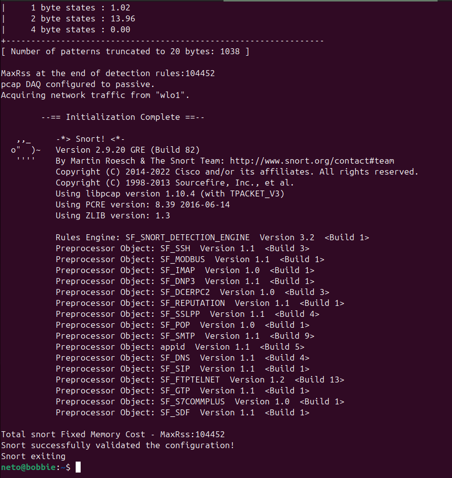
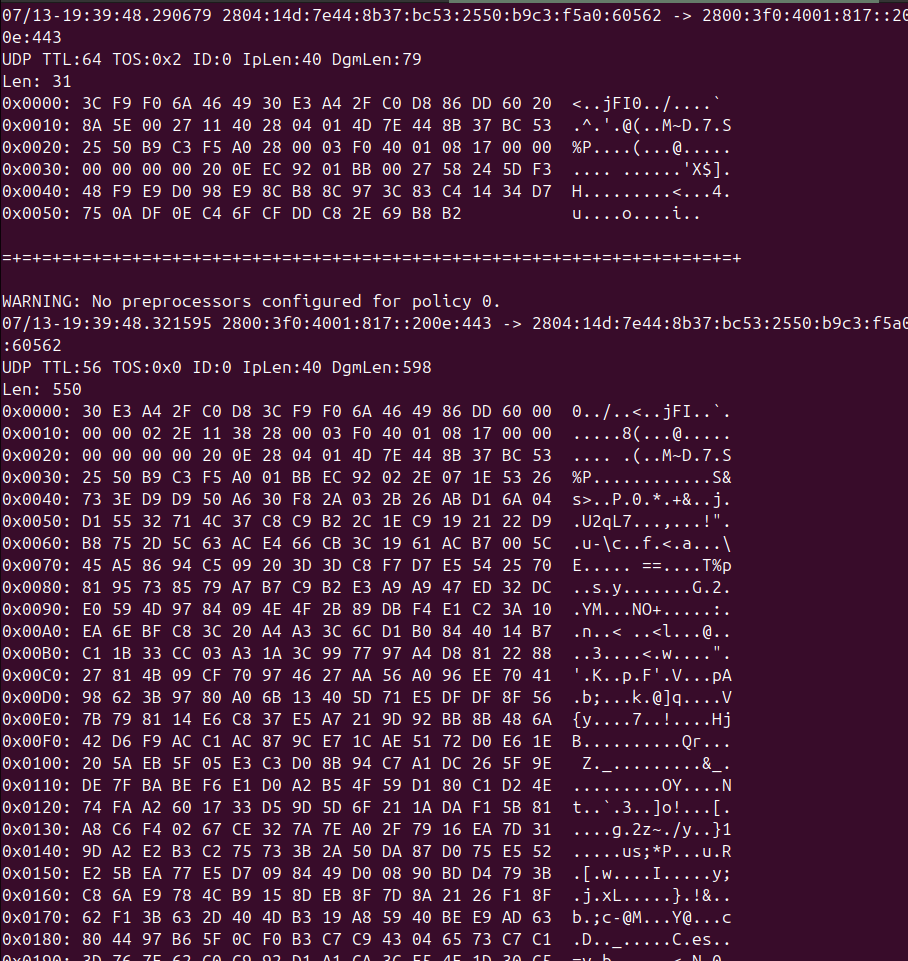
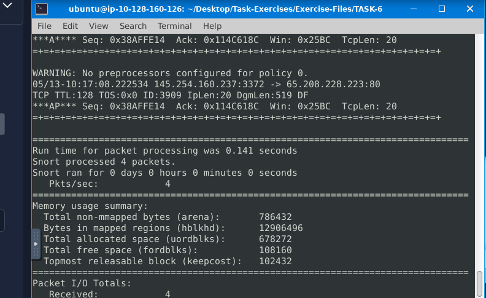
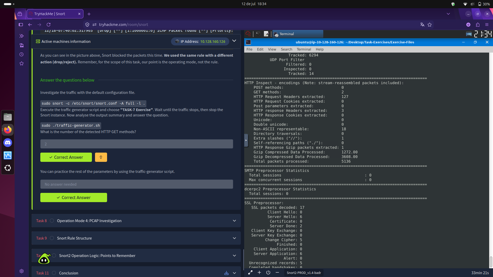
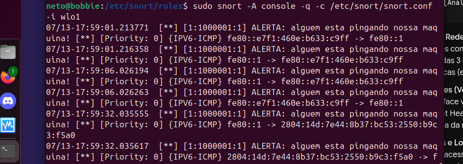
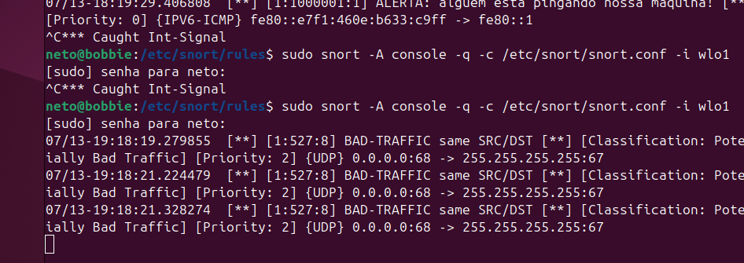

# 🐗 Snort — IDS/IPS na Prática

**Plataforma:** TryHackMe  
**Nível:** ⭐⭐ Médio  
**Categoria:** Blue Team / Network Security / IDS-IPS  
**Data:** 12-13/07/2026  
**Ambiente extra:** Laboratório pessoal no Ubuntu (Kali)

---

## O que é Snort?

Snort é um **NIDS/NIPS open source** criado por Martin Roesch e mantido pela Cisco Talos.
É uma das ferramentas mais usadas em ambientes SOC reais para monitorar e proteger redes.

**Versão utilizada:** 2.9.20 GRE (Build 82)

---

## 🧠 Conceitos base — IDS vs IPS

### A analogia do porteiro
- **IDS** = porteiro que **observa e alerta** — não barra ninguém
- **IPS** = porteiro que **observa e bloqueia** — age na hora

| Sigla | Tipo | Onde | Age? |
|-------|------|------|------|
| NIDS | Network IDS | Rede toda | ❌ só alerta |
| HIDS | Host IDS | Um computador | ❌ só alerta |
| NIPS | Network IPS | Rede toda | ✅ bloqueia |
| HIPS | Host IPS | Um computador | ✅ bloqueia |
| NBA | Behaviour-based | Rede toda | ✅ bloqueia |

### Tipos de detecção
| Técnica | Como funciona |
|---------|--------------|
| **Signature-Based** | Compara com padrões conhecidos de ataques |
| **Behaviour-Based** | Aprende o normal e alerta o anormal (precisa de *baselining*) |
| **Policy-Based** | Compara com regras e políticas da organização |

---

## ⚙️ Modos do Snort

| Modo | O que faz |
|------|----------|
| **Sniffer** | Lê e exibe pacotes na tela em tempo real |
| **Logger** | Captura e salva pacotes em arquivo |
| **IDS/IPS** | Analisa tráfego com regras e gera alertas ou bloqueia |

---

## 📌 Primeiros comandos

```bash
# Verificar versão e build number
snort -V

# Testar configuração
sudo snort -c /etc/snort/snort.conf -T
```

### 🖼️ Print — Configuração validada no Ubuntu pessoal


> Snort rodando na interface **wlo1** (Wi-Fi do Ubuntu).
> A mensagem **"Snort successfully validated the configuration!"** confirma que tudo está correto.

---

## 👁️ Modo Sniffer

| Parâmetro | O que mostra |
|-----------|-------------|
| `-v` | IP origem/destino, protocolo |
| `-d` | + conteúdo do pacote (payload) |
| `-e` | + endereço MAC |
| `-X` | Pacote inteiro em HEX |
| `-i interface` | Define qual placa de rede monitorar |

```bash
sudo snort -v -i wlo1     # básico
sudo snort -vd            # + conteúdo
sudo snort -X             # tudo em HEX
```

### 🖼️ Print — Output do modo -X (HEX completo)


> Tráfego UDP IPv6 capturado em tempo real.
> No modo `-X` cada byte do pacote é exibido em hexadecimal e texto ASCII ao lado.

---

## 💾 Modo Logger

```bash
# Salvar em formato binário
sudo snort -dev -l .

# Salvar em formato ASCII (legível)
sudo snort -dev -K ASCII -l .

# Ler um log salvo
sudo snort -r snort.log.XXXXXXXXXX

# Filtrar ao ler
sudo snort -r snort.log.XXXXXXXXXX 'tcp and port 80'
sudo snort -r snort.log.XXXXXXXXXX -n 10
```

| Formato | Como fica | Quem lê |
|---------|----------|---------|
| Binário (padrão) | Um arquivo `.log` | Snort, tcpdump, Wireshark |
| ASCII (`-K ASCII`) | Pastas por IP com arquivos texto | Qualquer editor |

---

## 🚨 Modo IDS/IPS

### Parâmetros

| Parâmetro | Função |
|-----------|--------|
| `-c arquivo.conf` | Define arquivo de configuração |
| `-A console` | Alertas rápidos no terminal |
| `-A cmg` | Alertas + payload em HEX no terminal |
| `-A full` | Alertas completos (só em arquivo) |
| `-A fast` | Alertas resumidos (só em arquivo) |
| `-A none` | Desativa alertas |
| `-N` | Desativa logging |
| `-D` | Roda em background (daemon) |
| `-q` | Modo silencioso (sem banner) |

```bash
# Alertas no terminal
sudo snort -c /etc/snort/snort.conf -A console

# Salvar alertas completos
sudo snort -c /etc/snort/snort.conf -A full -l .

# Rodar em background
sudo snort -c /etc/snort/snort.conf -D
ps -ef | grep snort        # verificar processo
sudo kill -9 PID           # parar processo
```

### Diferença no output

```
IDS (alerta):   [**] [1:10000001:0] ICMP Packet found [**]
IPS (bloqueia): [Drop] [**] [1:10000001:0] ICMP Packet found [**]
```

---

## 🏋️ Exercícios práticos — TryHackMe

### TASK-6 — Análise de logs com Snort
```bash
sudo snort -dev -K ASCII -l .
```

#### 🖼️ Print — Resultado TASK-6


**Resultados:**
- Snort processou **4 pacotes**
- Tráfego TCP: `145.254.160.237 → 65.208.228.223:80`

---

### TASK-7 — Modo IDS com tráfego HTTP
```bash
sudo snort -c /etc/snort/snort.conf -A full -l .
sudo ./traffic-generator.sh  # escolher TASK-7
```

#### 🖼️ Print — Resultado TASK-7


**Resultados encontrados no output:**
- **HTTP GET methods detectados:** `2` ✅
- HTTP Request Headers extracted: 127
- HTTP Response Headers extracted: 3
- Total packets processed: 5136

---

## 📁 Análise de PCAP

```bash
# Analisar um arquivo PCAP
sudo snort -c /etc/snort/snort.conf -q -r arquivo.pcap -A console

# Analisar múltiplos PCAPs
sudo snort -c /etc/snort/snort.conf -q --pcap-list="a.pcap b.pcap" -A console

# Ver qual PCAP gerou cada alerta
sudo snort -c /etc/snort/snort.conf -q --pcap-list="a.pcap b.pcap" -A console --pcap-show
```

---

## 📝 Regras do Snort

### Estrutura completa
```
alert  tcp  any  any  ->  192.168.1.0/24  80  (msg:"Mensagem"; sid:1000001; rev:1;)
ação  proto orig orig dir      dest       dest        opções
```

### Ações
| Ação | O que faz |
|------|----------|
| `alert` | Gera alerta e loga |
| `log` | Só loga |
| `drop` | Bloqueia (IPS) |
| `reject` | Bloqueia e avisa o remetente |

### Direção
```
->   origem → destino
<>   bidirecional (não existe <- no Snort!)
```

### Filtragem de IPs e Portas
```bash
# IP específico
alert icmp 192.168.1.56 any <> any any (msg:"IP fixo"; sid:1000001; rev:1;)

# Subnet
alert icmp 192.168.1.0/24 any <> any any (msg:"Subnet"; sid:1000001; rev:1;)

# Excluir IP (!)
alert icmp !192.168.1.0/24 any <> any any (msg:"Externo"; sid:1000001; rev:1;)

# Porta específica
alert tcp any any -> any 22 (msg:"SSH"; sid:1000001; rev:1;)

# Faixa de portas
alert tcp any any -> any 1:1024 (msg:"System ports"; sid:1000001; rev:1;)

# Múltiplas portas
alert tcp any any -> any [21,23] (msg:"FTP/Telnet"; sid:1000001; rev:1;)
```

### Opções de payload
```bash
# Buscar texto no pacote
alert tcp any any -> any 80 (msg:"GET"; content:"GET"; sid:1000001; rev:1;)

# Ignorar maiúsculas
alert tcp any any -> any 80 (msg:"GET"; content:"GET"; nocase; sid:1000001; rev:1;)
```

### Opções de não-payload (cabeçalho)
```bash
# Filtrar por IP ID
alert any any -> any any (msg:"IP ID"; id:35369; sid:1000001; rev:1;)

# Filtrar flags TCP
alert tcp any any -> any any (msg:"SYN scan"; flags:S; sid:1000001; rev:1;)
alert tcp any any -> any any (msg:"Push-ACK"; flags:PA; sid:1000002; rev:1;)

# Mesmo IP origem e destino
alert udp any any <> any any (msg:"Same IP"; sameip; sid:1000001; rev:1;)

# Tamanho do payload
alert ip any any <> any any (msg:"Pacote grande"; dsize:100<>300; sid:1000001; rev:1;)
```

### Flags TCP — referência
| Flag | Letra | Uso |
|------|-------|-----|
| SYN | `S` | Início de conexão — usado em scans |
| ACK | `A` | Confirmação |
| FIN | `F` | Fim de conexão |
| RST | `R` | Reset |
| PSH | `P` | Push (enviar dados imediatamente) |
| URG | `U` | Urgente |

### SIDs — regra de numeração
```
< 100          → Reservado
100 - 999.999  → Regras do Snort
>= 1.000.000   → Suas regras personalizadas
```

---

## 🧪 Laboratório pessoal — Ubuntu

Além das salas do TryHackMe, instalei o Snort no meu próprio Ubuntu
e criei regras personalizadas para testar na prática.

### Regra criada — detectar pings em português

```bash
# /etc/snort/rules/local.rules
alert icmp any any <> any any (msg:"ALERTA: alguem esta pingando nossa maquina!"; sid:1000001; rev:1;)
```

### Rodando na interface Wi-Fi (wlo1)
```bash
sudo snort -A console -q -c /etc/snort/snort.conf -i wlo1
```

#### 🖼️ Print — Regra detectando pings em tempo real


> A regra disparou ao detectar tráfego **IPV6-ICMP** — pings reais da rede local.
> Isso confirma que o Snort está funcionando corretamente no ambiente pessoal.

---

### BAD-TRAFFIC — mesmo IP de origem e destino

O Snort também detectou automaticamente tráfego com **mesmo IP de origem e destino**
(comportamento suspeito associado a loops ou ataques):

```
[1:527:8] BAD-TRAFFIC same SRC/DST
{UDP} 0.0.0.0:68 -> 255.255.255.255:67
```

#### 🖼️ Print — BAD-TRAFFIC detectado


---

## ⚙️ Arquivo de configuração (snort.conf)

```bash
sudo nano /etc/snort/snort.conf
sudo nano /etc/snort/rules/local.rules
```

### Variáveis principais
| Variável | Função | Exemplo |
|----------|--------|---------|
| `HOME_NET` | Sua rede protegida | `192.168.1.0/24` |
| `EXTERNAL_NET` | Rede externa | `!$HOME_NET` |
| `RULE_PATH` | Pasta das regras | `/etc/snort/rules` |

### Tipos de regras disponíveis
| Tipo | Custo | Frequência |
|------|-------|-----------|
| Community | Gratuito, sem cadastro | Menos frequente |
| Registered | Gratuito, com cadastro | 30 dias de atraso |
| Subscriber | Pago | 2x/semana |

---

## 🚀 Cheatsheet rápido

```bash
# Verificação
snort -V
sudo snort -c /etc/snort/snort.conf -T

# Sniffer
sudo snort -v -i wlo1
sudo snort -X

# Logger
sudo snort -dev -l .
sudo snort -dev -K ASCII -l .
sudo snort -r arquivo.log 'tcp and port 80'

# IDS/IPS
sudo snort -c /etc/snort/snort.conf -A console
sudo snort -c /etc/snort/snort.conf -A full -l .

# PCAP
sudo snort -c /etc/snort/snort.conf -q -r arquivo.pcap -A console

# Regras
sudo nano /etc/snort/rules/local.rules
rm alert   # limpar alertas anteriores
```
